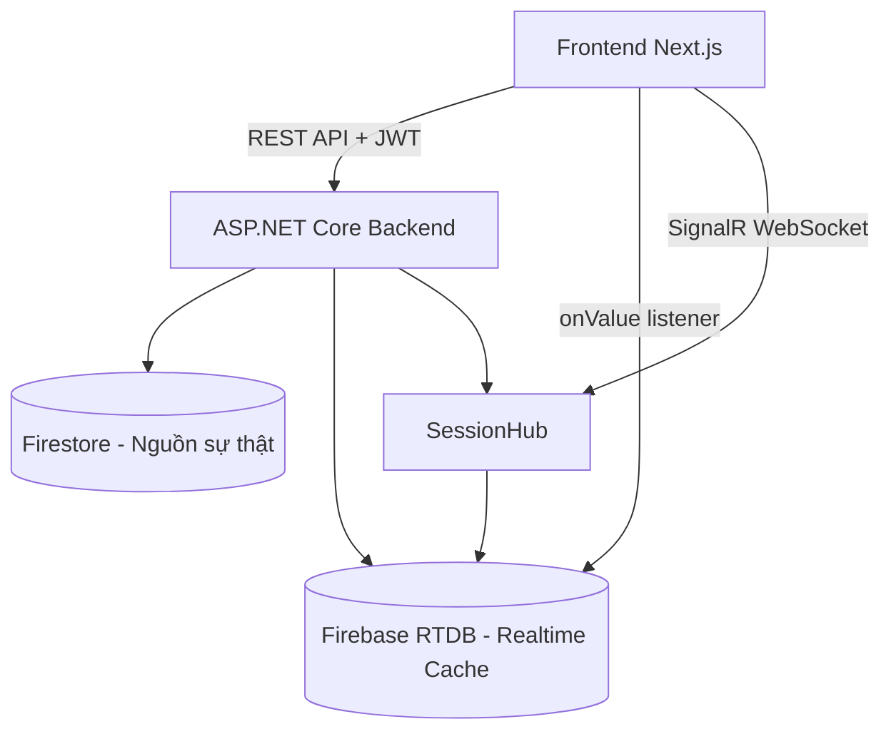
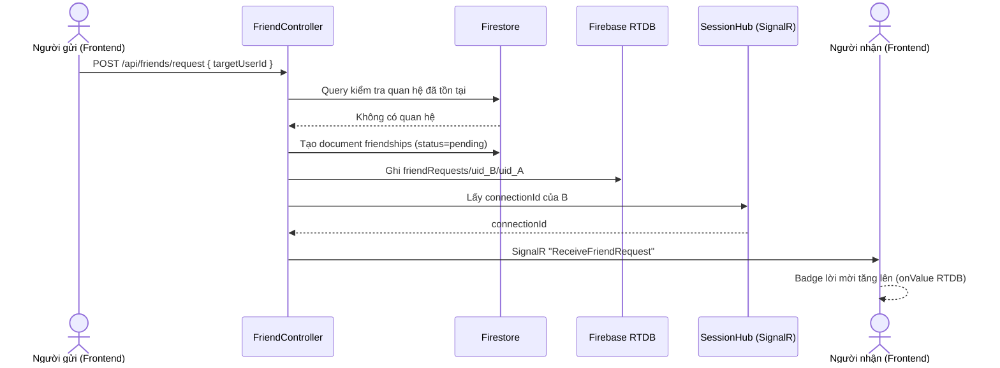
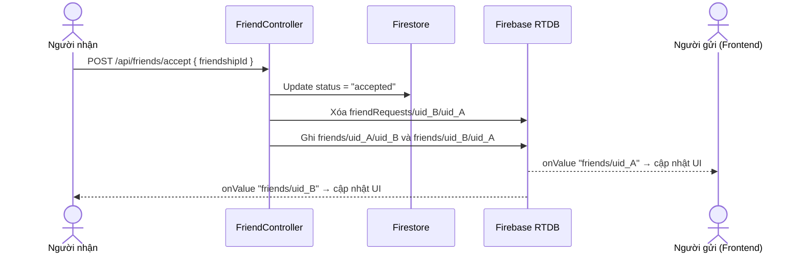
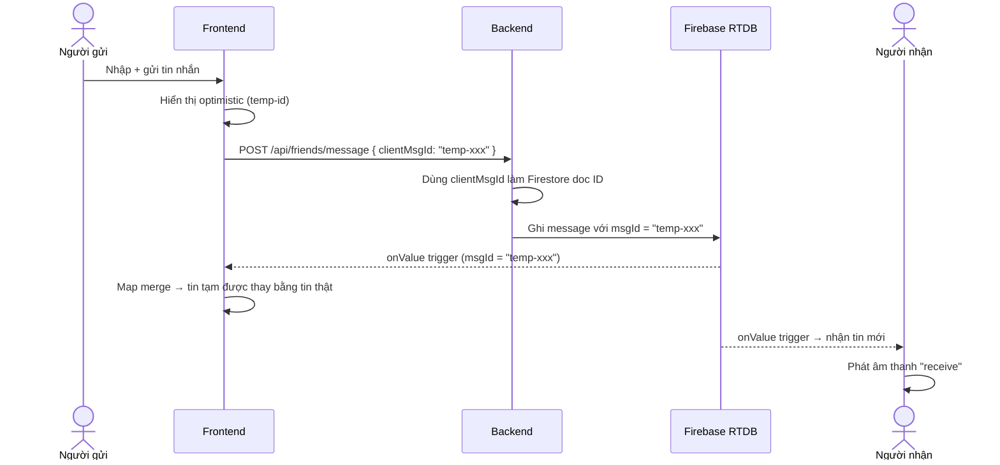
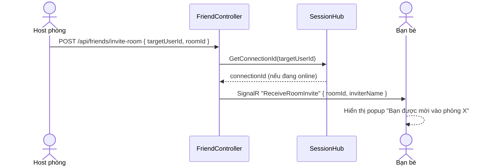

# Phân Tích Hệ Thống Bạn Bè — NT106-DoAn-Nhom08

## Tổng Quan Kiến Trúc

Hệ thống bạn bè được xây dựng theo mô hình **3 lớp**:



---

## 1. Mô Hình Dữ Liệu

### Firestore (Nguồn dữ liệu chính)
| Collection | Mô tả |
|---|---|
| `friendships` | Document chứa quan hệ bạn bè |
| `users` | Thông tin người dùng |
| `FriendChats/{friendshipId}/Messages` | Lịch sử tin nhắn (Firestore subcollection) |

**Cấu trúc document `friendships`:**
```json
{
  "id": "guid",
  "requesterId": "uid_A",
  "addresseeId": "uid_B",
  "status": "pending | accepted | blocked",
  "createdAt": "Timestamp",
  "updatedAt": "Timestamp"
}
```

### Firebase Realtime Database (Cache cho Realtime UI)
| Path | Mục đích |
|---|---|
| `friends/{uid}/{friendId}` | Cache danh sách bạn bè → hiển thị nhanh |
| `friendRequests/{uid}/{requesterId}` | Badge số lời mời đang chờ |
| `presence/{uid}` | Trạng thái Online/Offline/In-Match |
| `friend_chats/{friendshipId}/messages` | Cache 30 tin nhắn mới nhất |
| `unread_messages/{uid}/{friendshipId}` | Cờ báo tin nhắn chưa đọc |

---

## 2. Luồng Nghiệp Vụ

### 2.1 Gửi Lời Mời Kết Bạn



### 2.2 Chấp Nhận / Từ Chối



### 2.3 Hủy Kết Bạn & Chặn

| Hành động | Firestore | RTDB |
|---|---|---|
| **Unfriend** | Xóa document friendship | Xóa `friends/uid_A/uid_B` + `friends/uid_B/uid_A` |
| **Block** | Update/tạo doc với `status=blocked` | Xóa khỏi danh sách bạn + xóa lời mời |

---

## 3. Hệ Thống Presence (Trạng Thái Online)

Quản lý bởi **SessionHub** (SignalR):

```mermaid
stateDiagram-v2
    [*] --> Offline
    Offline --> Online: RegisterSession()
    Online --> Offline: OnDisconnectedAsync()
    Online --> In-Match: GameHub cập nhật
    In-Match --> Online: Kết thúc trận
```

- Khi user kết nối → `presence/{uid} = { status: "Online" }` trên RTDB + broadcast `FriendStatusChanged` đến tất cả client
- Khi ngắt kết nối → ghi `status: "Offline"` + broadcast
- Frontend lọc theo danh sách bạn bè để hiển thị đúng người

> [!NOTE]
> Broadcast gửi đến **toàn bộ** client (`Clients.All`). Frontend tự lọc theo danh sách bạn bè. Điều này đơn giản nhưng có thể gây tải cao khi số user lớn.

---

## 4. Hệ Thống Chat

### Cơ chế "Dual Write"
Khi gửi tin nhắn, backend ghi vào **2 nơi đồng thời**:
1. **Firestore** `FriendChats/{id}/Messages` — lưu trữ bền vững, pagination
2. **Firebase RTDB** `friend_chats/{id}/messages` — realtime push cho người nhận

### Optimistic UI
Frontend dùng `clientMsgId` (`temp-{timestamp}`) gửi lên backend làm Document ID thật trong Firestore. Nhờ đó tin nhắn tạm và tin nhắn thật có cùng ID → không bị nhân đôi khi RTDB push về.



### Tải thêm tin nhắn cũ (Pagination)
- 30 tin nhắn mới nhất: Đọc từ RTDB (nhanh, realtime)
- Cuộn lên trên: Gọi `GET /api/friends/message/{id}?beforeTimestamp=X` → query Firestore

---

## 5. Mời Bạn Vào Phòng



> [!IMPORTANT]
> Lời mời phòng chỉ hoạt động khi bạn bè **đang online và đã kết nối SessionHub**. Nếu offline → trả về lỗi 400 "Người dùng này hiện không online".

---

## 6. Cấu Trúc Frontend

### Trang `/friends`
```
FriendsPage
├── Tab "Danh sách" → <FriendList>
│   ├── Lắng nghe RTDB: friends/{uid}
│   ├── Lắng nghe RTDB: unread_messages/{uid}
│   ├── watchFriendPresence (RTDB: presence/{uid})
│   └── <FriendCard> × N
│       ├── Nút Chat → mở <FriendChat>
│       ├── Nút Mời phòng (nếu showInvite=true)
│       └── Menu: Hủy kết bạn / Chặn
├── Tab "Tìm kiếm" → <FriendSearch>
│   └── Debounce 500ms → GET /api/friends/search?q=
└── Tab "Lời mời" → <FriendRequests>
    ├── Lắng nghe RTDB: friendRequests/{uid} → badge đỏ
    └── Accept/Decline → xóa RTDB node
```

### Components bổ trợ
| File | Vai trò |
|---|---|
| [FriendModal.tsx](file:///c:/Môn%20học/DoAnMang/NT106-DoAn-Nhom08/frontend/components/friends/FriendModal.tsx) | Modal popup bao gồm FriendList + FriendChat (trong lobby/room) |
| [FriendCard.tsx](file:///c:/Môn%20học/DoAnMang/NT106-DoAn-Nhom08/frontend/components/friends/FriendCard.tsx) | Card hiển thị 1 bạn bè + level giả định |
| [FriendChat.tsx](file:///c:/Môn%20học/DoAnMang/NT106-DoAn-Nhom08/frontend/components/friends/FriendChat.tsx) | Giao diện chat với sound effect WebAudio |
| [SessionGuard.tsx](file:///c:/Môn%20học/DoAnMang/NT106-DoAn-Nhom08/frontend/components/SessionGuard.tsx) | Lắng nghe "ReceiveFriendRequest", "ReceiveRoomInvite" |

---

## 7. Điểm Mạnh & Hạn Chế

### ✅ Điểm Mạnh
- **Realtime tốt**: Kết hợp Firebase RTDB listener + SignalR cho UX mượt mà
- **Optimistic UI**: Tin nhắn hiển thị ngay, không cần chờ server confirm
- **Dual-source với auto-sync**: RTDB là cache, Firestore là nguồn sự thật; có logic tự đồng bộ lại
- **Presence hệ thống**: Phân biệt 3 trạng thái Online/In-Match/In-Room rõ ràng
- **Chống mất dữ liệu RTDB**: Dùng `clientMsgId` tránh nhân đôi tin nhắn

### ⚠️ Hạn Chế
- **Broadcast `Clients.All`** trong `SessionHub`: Mọi client đều nhận event `FriendStatusChanged`, không scale tốt
- **Tìm kiếm case-sensitive**: Firestore range query phân biệt hoa/thường (`"Minh"` khác `"minh"`)
- **Level bạn bè là giả** (`mockLevel` dựa vào `charCodeAt`), chưa có hệ thống xếp hạng thật
- **Block chưa ẩn người khỏi search results**: Logic chặn chỉ ngăn gửi lời mời, không loại khỏi kết quả tìm kiếm
- **Không có giới hạn số bạn bè** (`Limit(20)` chỉ áp dụng cho tìm kiếm)
